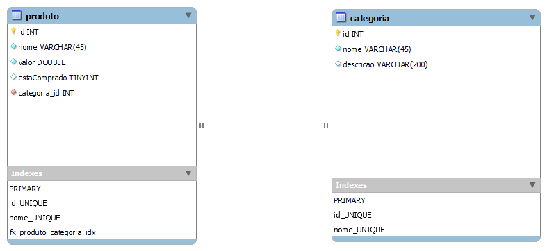

# FuturoDEV projeto final 

- *API* Rest em Spring Boot 
- CRUD de *produto* e *categoria*
- Inicialização: 
```git clone [link] && cd projeto-final-futurodev && mvn spring-boot:run```
- Modelo relacional das classes em banco PostgreSQL





made with <3